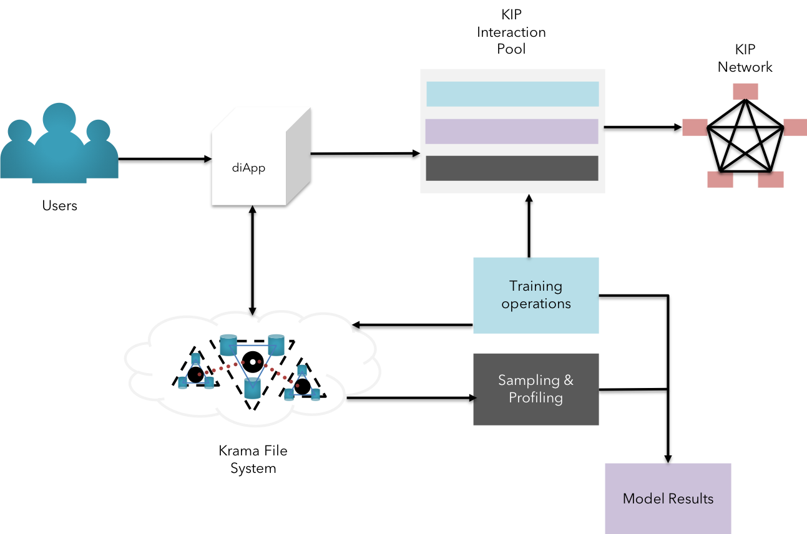

## Beyond blockchain

### Architectural renaissance

#### TDU

  
  
 <b>Fig 12:</b> TDU - New measure of persistence

  T.D.U. stands for Total Digital Utility. Essentially, TDU is a collective measure of disparate behavior of actors in the KIP ecosystem involved across different types of interaction on multiple diApps.

  TDU plays a major role in transforming existing digital *"transactions"* into *"interactions"* bearing multiple information vectors. This facilitates the developers to explore a whole new arena of business models and whitespace in the coming digital leap.

  TDU isn't a vehicle to merely capture datapoints. It offers a multi-dimensional value environment for all KIP users to leverage their respective interests and abilities to leverage services. (learn more on TDU [here](/pages/tdu/tdu-specs.md))

#### Big Data & Cognition

  
  
 <b>Fig 13:</b> Big data persistence & Cognition using KFS

  Big data has become an integral part of business processes at various levels of operations. However, emerging platforms have not been able to address the exponential cost of data replication and simply persisting the consensus of the stored data in a fault tolerant manner.  
  KIP differentiates itself in the market by enabling the users to store information on an external storage realm KFS  (Krama File System, an enhanced version of IPFS) that is capable of storing large volumes of various forms of data, yet maintaining the cryptographic state changes of the data.(learn more on big data persistence & AI practices [here](/pages/kfs/kfs-specs.md))

#### Scalability

  
  
 <b>Fig 14:</b> Dynamic scale-out & sentinel network organization on KIP

  Most business use-cases on several blockchain platforms are seldom scalable. This reflects the nascent stage of blockchain environment we are in. However, KIP spawns a new generation of blockchain solutions on top of its platform for truly scalable solutions.  
  This is made possible by leveraging PBFT <a href="#references">[7]</a> Hardened RAFT to support abrupt changes in the network strength. The deterministic approach encourages businesses to adopt a minimalistic approach to obtain exponential scaling on cost-efficient hardware, thereby contributing to a greener world.(learn more on scalability [here](/pages/tara/tara-specs.md))

#### Throughput

  
  
 <b>Fig 15:</b> Throughput using Modulated Trust in KIP 

  Real-time businesses such as VISA and other retail or commercial payment systems process thousands of transactions per second. This is far from the current state of majority of blockchain protocols. Waiting for a confirmation of a coffee purchase over sale of diamond doesn’t make true sense in day-to-day life.  
  This issue is addressed in KIP by allowing users to choose the level of trust needed to approve of the transaction between the parties. We call it the “modulated trust”. KIP adopts the modulated trust by leveraging TARA <a href="#references">[8]</a> (Ternary Augmented RAFT Architecture) to achieve partial confirmations from nodes designated by the users(we call them as “fast followers”) as well as stakeholders from other regulatory authorities(we call them as “shadow followers”).(learn more on modulated trust [here](/pages/tara/tara-specs.md))

#### Predictable TCO & Finality

  
  
 <b>Fig 16:</b> Predictable gas price

  Predictable gas cost & Transaction finality makes sense to business use-cases where assets are represented in some form and certainty is expected on the ownership of such assets. Many public & private blockchain platforms seem to take on this challenge from a game-theory & crypto-economic approach.  
  As a business-centric blockchain, KIP primarily leverages the fact that private and permissioned blockchains can design intricacies to punish bad actors economically and legally to ensure finality on the assets exchanges between users.  
  KIP also introduces “Multi-Tier nodes” to ensure Txn finality & apt gas usage, thereby encouraging the enterprise in adopting KIP for predictable gas cost. (learn more on predictable gas cost [here](/pages/technical-primer/TechnicalPrimer.md))