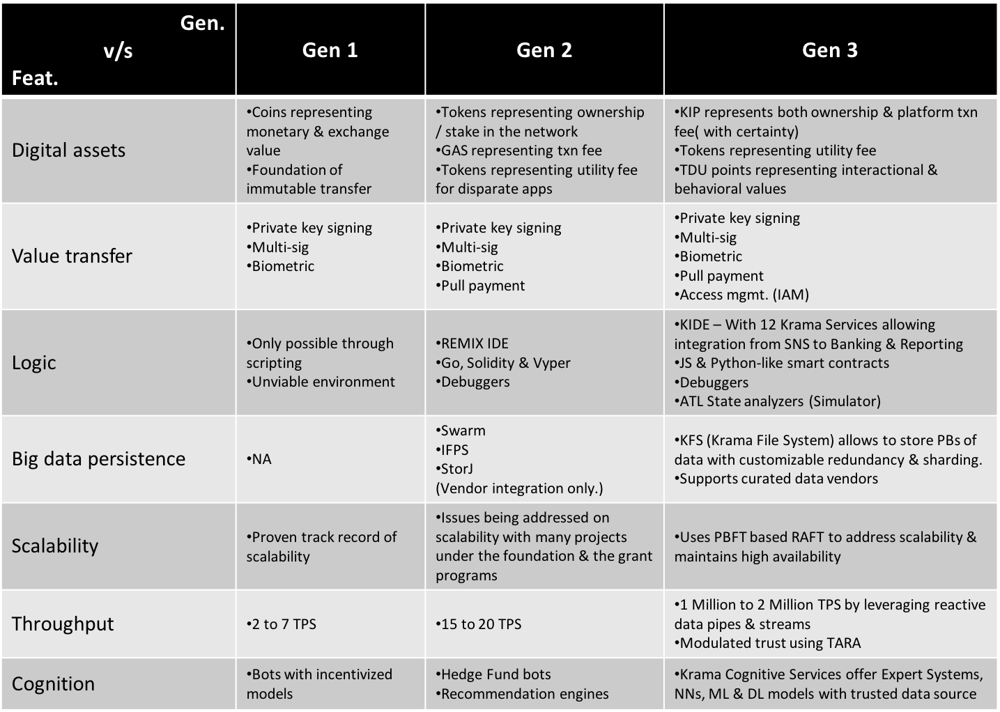

## Blockchain landscape

### Background

Evolution of business and its underlying processes always encourage technological advancement in computation & storage. This has led the world to roll through significant leaps in technology & the way its perceived globally.

It all started with the computing era in late 50’s and the early 60’s when computers were being used to process mathematical and scientific calculations to improve speed and accuracy. Data was moved from papers to disks and tapes. Traditional business processes were transformed by the help of computers resulting in increased efficiency. Computers increased the productivity of companies by several folds. A lot of companies started in this era wrote software to help businesses and then licensed these software to end users. The unit of value in this computing era was the ‘Product’ and the underlying technology played a very supportive role, although early in its existence.

The introduction of TCP/IP to the world proved to be the fusion of the _"Information Era"_ with the _"Augmentation Era"_, both at individual and institutional levels. TCP/IP allowed the flattening of the world. Anybody with a computer could be connected to other computers around the world and it created an immense opportunity to host services to interact and exchange information with each other. New value driven models moved from being 'product-centric' to 'customer-centric'. The success of most companies was directly proportional to the number of customers the company served. Search engine companies occupied mainstream spotlight as they had the best number of customers using their services. Lots of other start-ups like Amazon, Facebook, Airbnb and Uber were born that leveraged the power of internet to discover & propagate business-driven network effects. But such intermediaries and aggregators influenced everything in the market dynamics as most of the core components driving these models were centralized in the form of entities, both at business and technology levels.

From the _"Information Era"_ where everything is centralised, the world has been moving on to an age where critical components are being decentralised. In contrast to the key driver as 'data' in _"Augmented Era"_, 'Interaction' is the key to driving new values in the hyper connected digital world. Blockchain is the new technological institution that will fundamentally change how we discover, generate & exchange values.

With an inherent nature of insecurity, humans always depended upon trusted intermediaries to lower uncertainty in exchanging values. With the implementation of blockchain technology, we may be able to reduce the dependency on traditional institutions like banks, corporations and governments to reduce uncertainty and exchange value in the digital world. Several blockchain platforms & technologies have been able to find partial success in disintermediating the incumbents that failed to operate better under ethical & performance grounds.

 <b>Fig 1:</b> Generations of Blockchain <a href="#references">[1][2]</a> 

- **Gen 1 Blockchain**

  Bitcoin transactions are based on the UTXO(Unspent Transaction Outputs) model, with each UTXO having a denomination and an owner (defined by a 20-byte address which is essentially a cryptographic public key[1]), that identifies each bitcoin with its own identity with fungible behaviour, i.e., to be able to transfer parts or the whole bitcoin from one wallet to another with a degree of divisibility to identify fractional parts of bitcoin.

  
  
 <b>Fig 2:</b> Bitcoin State Transition <a href="#references">[1][2]</a>

  As depicted in the above figure, the bitcoin transaction is responsible for state changes due to transfer of bitcoins from one wallet to another. Almost all the transactions evolved in this blockchain is user-driven, meaning the transaction was directly signed by the user holding bitcoins in the wallet.

- **Gen 2 Blockchain**

  Ethereum defines its state transition system as a function which formally verifies a few conditions before executing the transactions that could be directly user-driven or a smart automated contract call from the low-level script executed by the EVM(Ethereum Virtual Machine) based on a few logical triggers driven by oracles etc.

  
  
 <b>Fig 3:</b> Ethereum State Transition <a href="#references">[2]</a>

  Before mining, Ethereum transactions are validated by several factors including signature, balance, sender's nonce count, enough gas balance, & validity of receiving account.