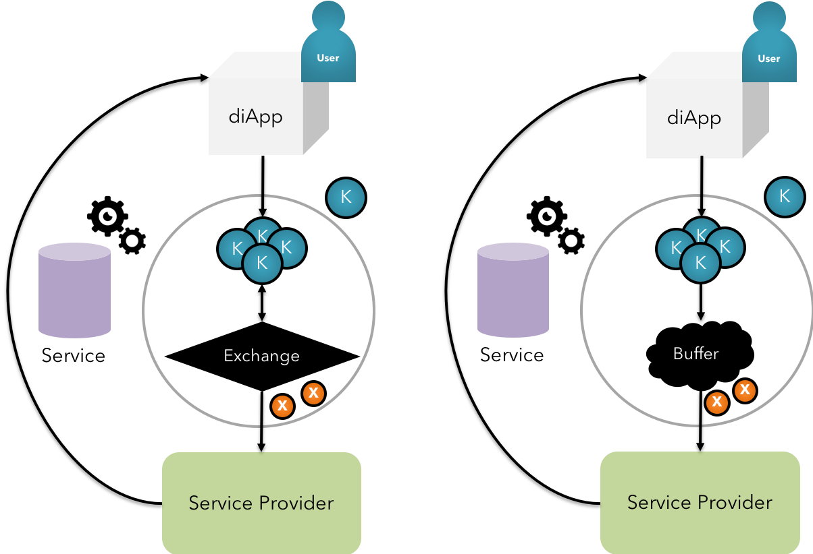

### Token economy & DEX

KIP Tokens are an universal interface to all app tokens on the KIP platform and affiliated marketplaces. Developers specify the app token characteristics using Krama Tokenization Services. This is reflected in the token interface smart contract corresponding to the diApp, takes the service usage into account and charge the user for the same.

 <b>Fig 18:</b> KIP Exchange & Buffer Mechanism

KIP stands out from the rest in Tokenization aspects by allowing both buffer & exchange mechanisms, thereby achieving a universal interface that balances the supply demand of app tokens in the digital ecosystem. All app tokens shall be ICO’ed by the entity offering the DIapp solution and integrated with an inline index to address volatility and entry.

KIP also possesses a unique self-balancing utilitarian formula to calculate platform fee and transaction fee for nodes responsible for consensus, and incentivizes the validators’ interests by awarding slice of TDU Scores in the dimensions relevant to trust and economic activities.

 <b>Fig 19:</b> KIP Internal DEX

DEX has become a dire necessity in any multilateral blockchain ecosystem, where token can be intermittently exchanged between 2 parties, when required, to avail a particular service from a vendor.

KIP shall possess an internal DEX that facilitates the exchange of complimentary tokens. (learn more on DEX working [here](/pages/technical-primer/TechnicalPrimer.md))