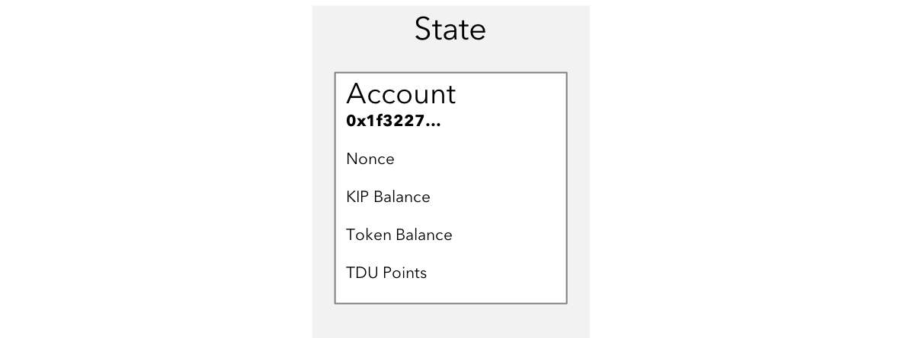
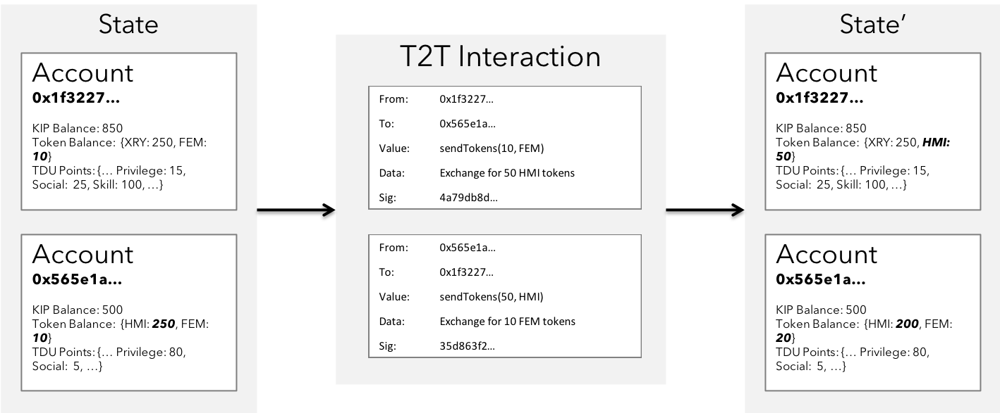
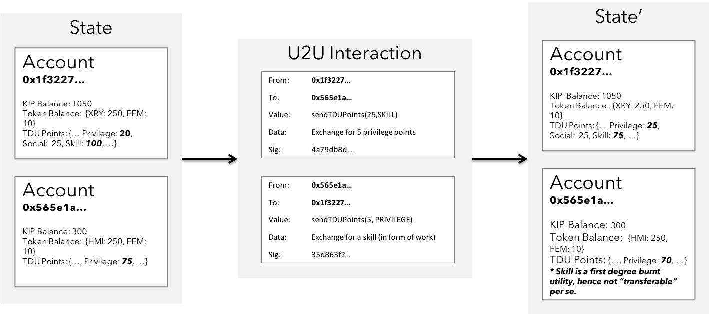
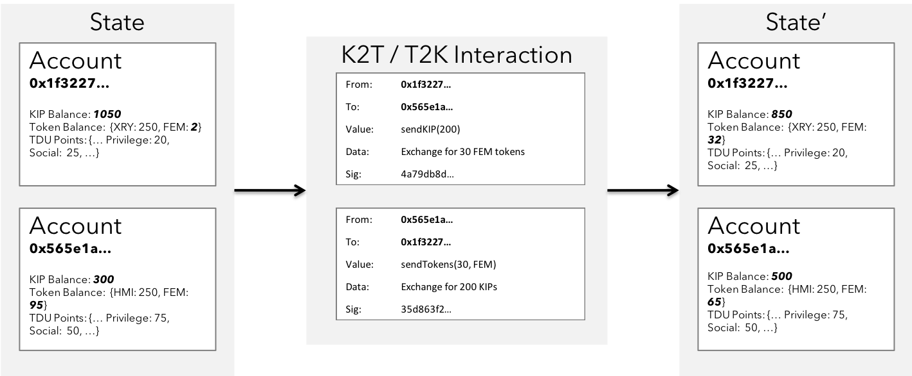
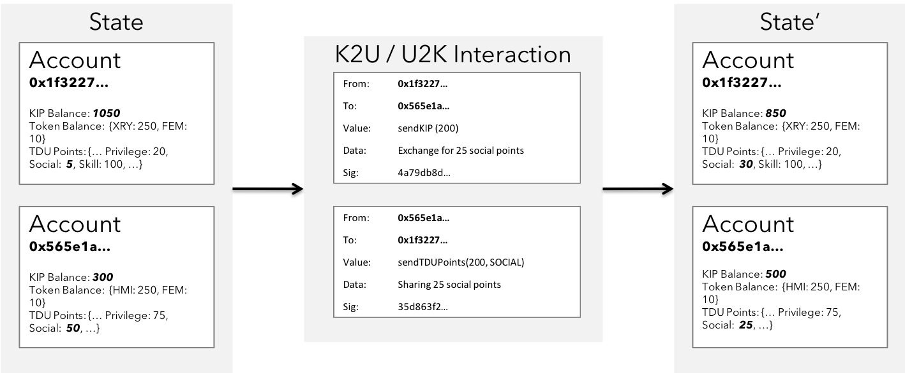

### System Overview

The order is moving from Transactions to Interactions. KIP leverages emergent techniques & mechanism in the blockchain (such as constellation, zk-Snarks etc.), along with other path breaking technologies in storage (such as swarm key, IPFS etc.).  

#### KIP Wallet Account State

 <b>Fig 5:</b> Typical KIP Account's State

As depicted in the figure above, a typical KIP account managed by the user consists of the KIP balance, nonce count for all the transactions signed on behalf of corresponding account, token balance representing the closing balance of number of tokens left, and the TDU points - an array of balances representing a dimension of TDU in the KIP ecosystem based on the user's behaviour.

#### K2K Interaction state transition

 <b>Fig 6:</b> A K2K Interaction state transition

The figure depicts a simple 1-way interaction that involves transfer of KIP from one account to another. In this case, one of the colleague is paying up for their lunch paid by one of the other peer. A split in the bill contract could spawn such interactions.

#### T2T Interaction state transition

 <b>Fig 7:</b> A T2T Interaction state transition

The figure depicts yet another simple interaction that involves transfer of tokens of some characteristics from one account to another. In this case, there exists a 2-way interaction with transactions exchanging heterogenous tokens at an agreed rate of exchange.

#### U2U Interaction state transition

 <b>Fig 8:</b> A U2U Interaction state transition

The figure depicts yet another simple interaction that involves exchange of heterogenous TDU points for service of a specific skill in exchange for privilege to access another service of some arbitrary form. This is an improvement in the Gen3 where non monetary interests can be realized to achieve similar importance & access to services.

#### T2K / K2T Interaction state transition

 <b>Fig 9:</b> A K2T / T2K Interaction state transition

This figure depicts a hybrid 2-way interaction between two users, due to a mutual demand in heterogenous asset classes - the universal `KIP` & app specific token `FEM` . A typical scenario for such transactions apepar in DEX applications & application service billing buffers.

#### K2U / U2K Interaction state transition

 <b>Fig 10:</b> A K2U / U2K Interaction state transition

This figure depicts yet another 2-way hybrid interactions with demand for utility payable by KIP. Other way, there's a mutual demand for KIP tokens for exchange of acceptable TDU points belonging to a certain dimension.
Such interactions occur under social and professional applications built on KIP where the declared attributes can be audited for transparency before harnessing.

#### T2U / U2T Interaction state transition

 <b>Fig 11:</b> A T2U / U2T Interaction state transition

This figure depicts yet another 2-way interaction with mutual demand for heterogenous asset classes - app tokens with specific characteristics needed to access services, & the TDU points in a specific dimension that is transferable and consumed for similar access to service.
Such interactions may occur in bug bounty & marketplace applications where users are willing to crowdsource in exchange for their app tokens.