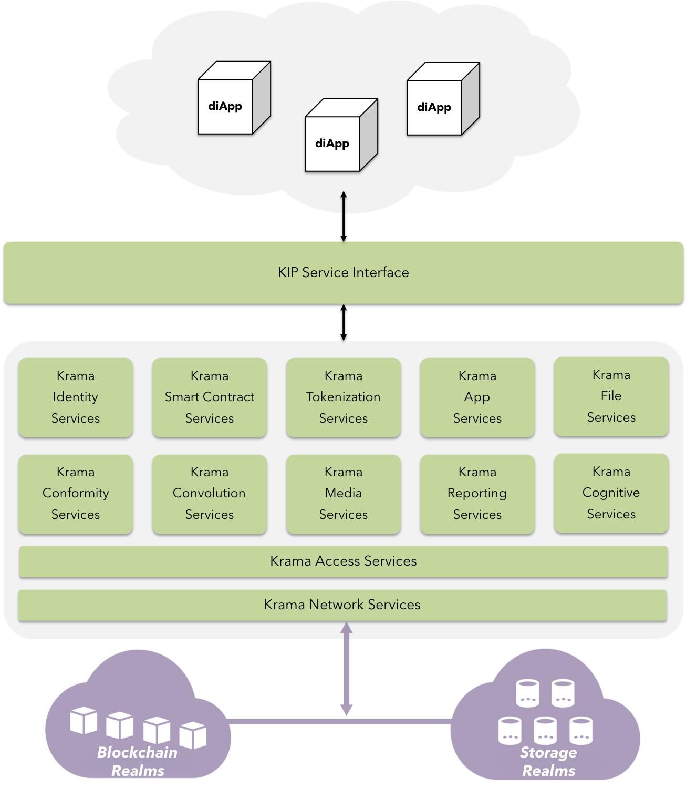

## Krama - The new digital order

### Enter KIP

 <b>Fig 4:</b> Krama PoV

Bitcoin and the underlying blockchain mechanism are technological homerun. Blockchain gives back the power in the hands of individuals by removing the need of intermediaries to exchange value directly, hence truly enabling decentralized economies and transform tedious processes that involve human interventions that are susceptible to radical thinking.  

Bitcoin was successfully able to decentralize the supply of currency by reward mechanisms.

Bitcoin's limitation to directly facilitate logical operations for means of transfer evolved Ethereum - a platform to develop truly distributed applications.  

However, ethereum failed to address scalability and throughput issues faced by public blockchain network such as the Bitcoin. Also, ethereum has failed to deliver expectations of the enterprise in maintaining stability of the GAS paid in the divisible form of Ethers(ETH). The gas volatility effect across the network makes it inconvenient for the users to continue with their smart contracts.

In real world scenarios, Blockchain must be paired up with other technologies to truly disrupt the landscape for successful adoption.

KIP addresses this challenge by adding context to the blockchain by leveraging IPFS to scale storage-hungry applications, and KIDE for seamless development experience.

Major components encompassing the KIP ecosystem are:

- **diApp:** The distributed intelligent application

- **KIP Service Interface:** Authenticate & relay user requests to managers of all the Krama services mentioned.

- **Krama Identity Services:** Authenticate actors using external sources such as social IDs, Govt. issued IDs, Dev account IDs & Devices.

- **Krama Smart Contract Services:** Manage accounts, facilitate logical operations, manage accessibility, and security.

- **Krama Tokenization Services:** Float, transfer & manage ERC standard tokens by their characteristics.

- **Krama App Services:** Manage various app-generics ranging from PIN Locks, custom UX elements to deep linking messaging etc.

- **Krama File Services:** On-demand CRUD Operations on KFS & external storage realms.

- **Krama Conformity Services:** Manage & monitor device-level attributes to authenticate actors responsible for high-value transactions.

- **Krama Convolution Services:** Recognize physical objects & tag them for accountability in blockchain realm.

- **Krama Media Services:** Facilitate easier off-chain media integration with applications.

- **Krama Reporting Services:** Allow easy plotting various types of graphs & charts across multiple platforms.

- **Krama Cognitive Services:** Allow integration of various intelligence models to trusted source of transaction & state data.

- **Krama Access Services:** Manage contract ownership, lifecycle & network attributes.

- **Krama Network Services:** Relay & manage transactions / state data from heterogenous blockchain & storage realms.

- **Blockchain Realm:** A multiverse connecting heterogenous blockchain environments run by other consortia under wide range of protocols such as Bitcoin, Ethereum, Sawtooth Lake, Iroha, NEO, EOS <a href="#references">[3]</a>  etc.

- **Storage Realm:** A multiverse connecting the KFS(Krama File System) along with external P2P distributed storage services such as IPFS, StorJ etc.